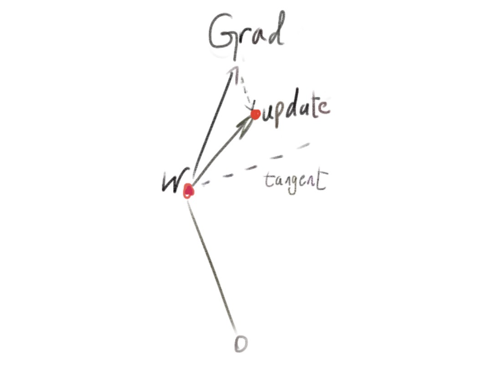
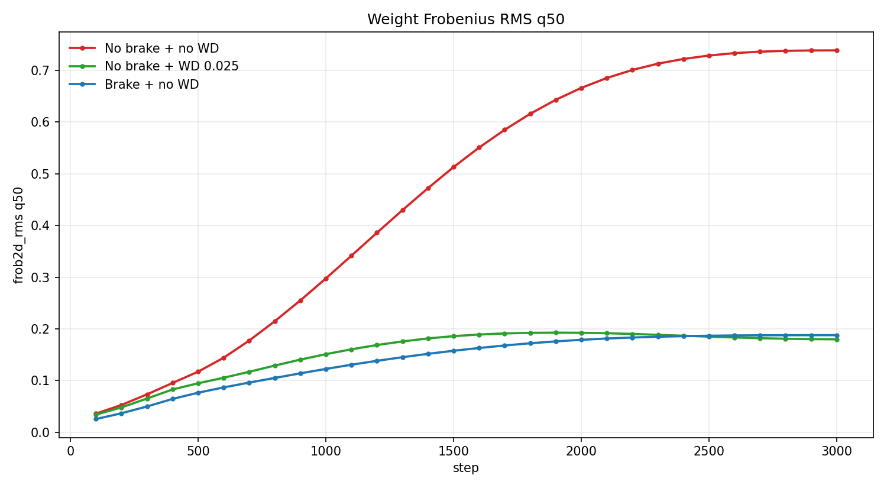
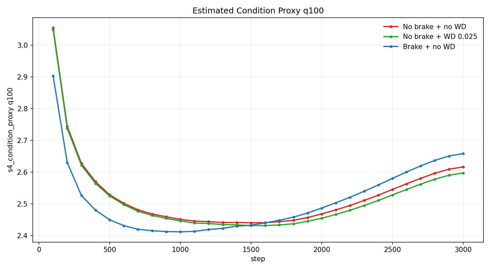
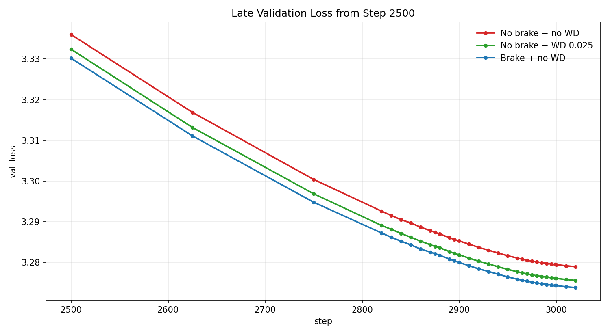

# Radial Brake

A comparison of radial update damping, explicit weight decay, and no radial constraint.

Radial brake dampens the radial component of the update vector, in my experiments by a factor `OUTWARD_SCALE_FACTOR = 0.5`. Another correction is applied, normalizing to 

`norm = prev_norm + OUTWARD_SCALE_FACTOR * OUTWARD_COMPONENT_LENGTH`,

to adjust for outward drift from following tangent directions in a straight line. The procedure is related to [AdamP](https://arxiv.org/abs/2006.08217) (roughly `OUTWARD_SCALE_FACTOR = 0`) and [hyperball](https://arxiv.org/abs/2010.02916), roughly (`OUTWARD_SCALE_FACTOR = INWARD_SCALE_FACTOR = 0`).

## Experimental Setting

The plots below are based on [PR300](https://github.com/KellerJordan/modded-nanogpt/pull/300) from the [modded nanogpt track 3](https://github.com/KellerJordan/modded-nanogpt/tree/master/records/track_3_optimization). This is [PrimeIntellect's](https://www.primeintellect.ai/) autoresearch PR which inherits from my 2990-step record which introduces the radial brake.

## Weight Norms

Median per-tensor dimension-normalized Frobenius RMS. 

## Condition Proxy

Maximum estimated condition number proxy based on the logged Schatten-4-style statistic (Schatten 4-norm/2-norm).

## Late Validation Loss

Validation loss from step 2500 onward.
