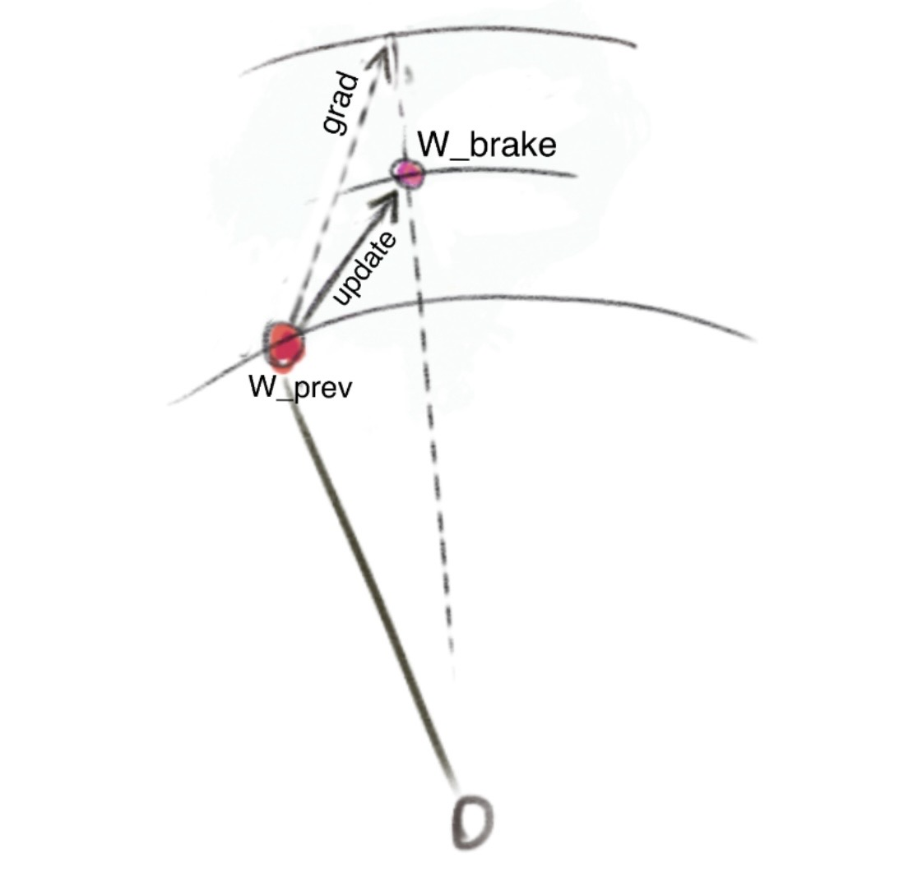

# Radial Brake

Radial brake dampens the radial component of the update vector, in my experiments by a factor `OUTWARD_SCALE_FACTOR = 0.5`. 

### Simplest definition

The cleanest definition is as follows. Apply the usual gradient update `w := w_prev + dw` to the weights. Then re-scale `w` to `w_brake` such that 

`||w_brake|| = ||w_prev|| + OUTWARD_SCALE_FACTOR * (||w||-||w_prev||)`,

if `||w||>||w_prev||`. Wtherwise `OUTWARD_SCALE_FACTOR` is replaced by `INWARD_SCALE_FACTOR`.
The procedure is related to [AdamP](https://arxiv.org/abs/2006.08217) (roughly `OUTWARD_SCALE_FACTOR = 0`) and [hyperball](https://arxiv.org/abs/2010.02916), roughly (`OUTWARD_SCALE_FACTOR = INWARD_SCALE_FACTOR = 0`).

The left picture below shows the direct norm-rescale definition described above. The picture on the right shows first-order radial-component picture which was used in the experiments below.

| Clean norm-rescale definition | First-order radial update view |
| --- | --- |
|  |  |

## Experimental Setting

The plots below are based on [PrimeIntellect's](https://www.primeintellect.ai/) 2930-step autoresearch record [PR300](https://github.com/KellerJordan/modded-nanogpt/pull/300) from the [modded nanogpt track 3](https://github.com/KellerJordan/modded-nanogpt/tree/master/records/track_3_optimization). This record inherits from my 2990-step record PR294 where I introduced the radial brake. The implementation in these experiments differs slightly but agrees to first order and should not give materially different results.

## Weight Norms

Median per-tensor dimension-normalized Frobenius RMS. 

## Condition number proxy

We use a robust proxy for the condition number based on the Schatten 4-norm/2-norm. The Schatten 4-norm estimates works as a rough proxy for the operator norm, and the 2-norm can be viewed as an average of singular values, which is a more robust alternative to the smallest singular value. 

Maximum estimated condition number proxy based on the logged Schatten-4-style statistic (Schatten 4-norm/2-norm).

## Late Validation Loss

Validation loss from step 2500 onward.
